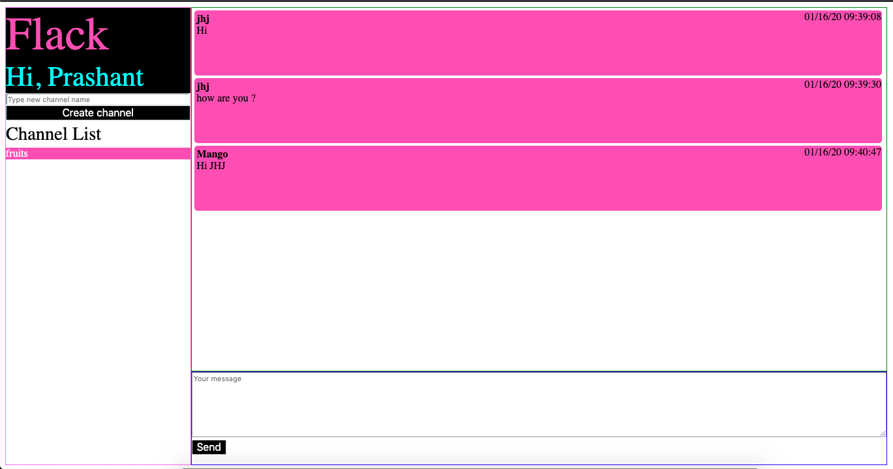

# HarvardX: CS50W
[CS50's Web Programming with Python and JavaScript](https://courses.edx.org/courses/course-v1:HarvardX+CS50W+Web/course/)

## Project 2

Web Programming with Python and JavaScript

This a chatting application , named Flack, much like Slack .
It is built using Python, Flask, Socketio, Javascript, HTML and CSS .

- At first user should select a unique display name for starting the chat .
- Once entered in chatting area , the user should create a channel or select a 
already existing channel to communicate with other users .
- User can mark a post in green color .
- User can delete a post and it will disappeared from everyone's browser without reloading.

Personal Touch:
- User can right click on a post and mark it green .
- User can right click on a post and delete it , if it's created by them .

Code walkthrough : https://youtu.be/04EvMNBOm8o

Try the app : https://flackthechat.herokuapp.com
